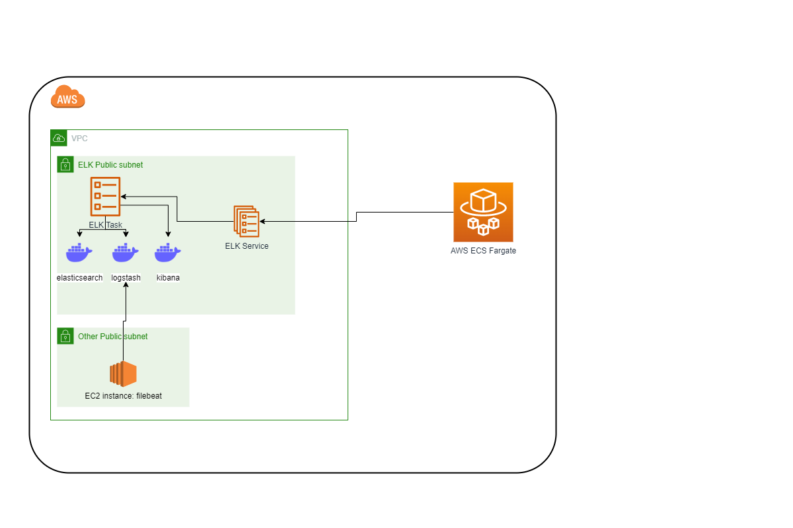
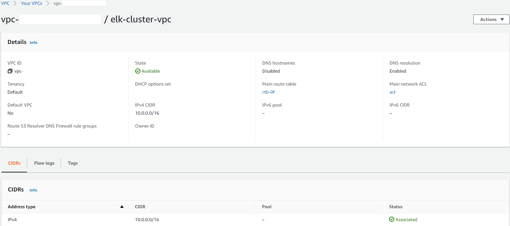
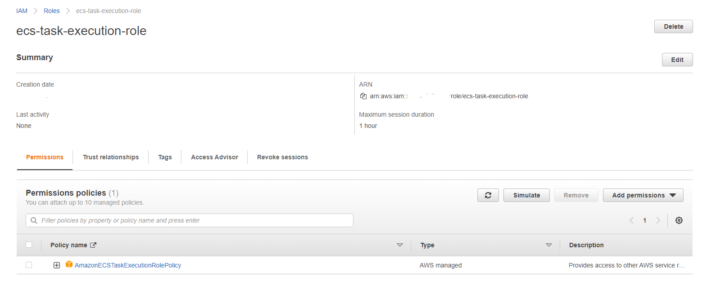
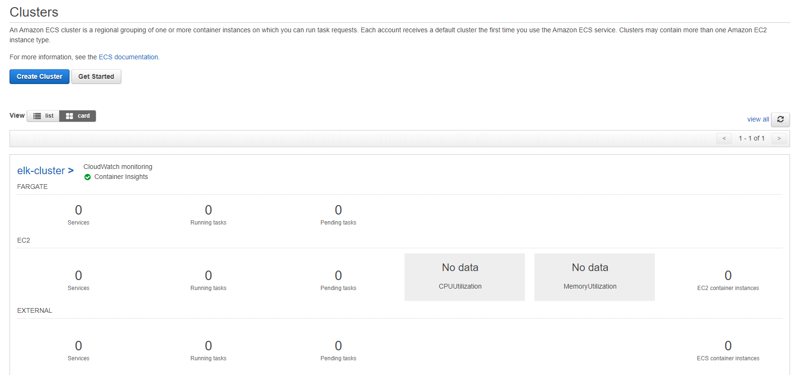
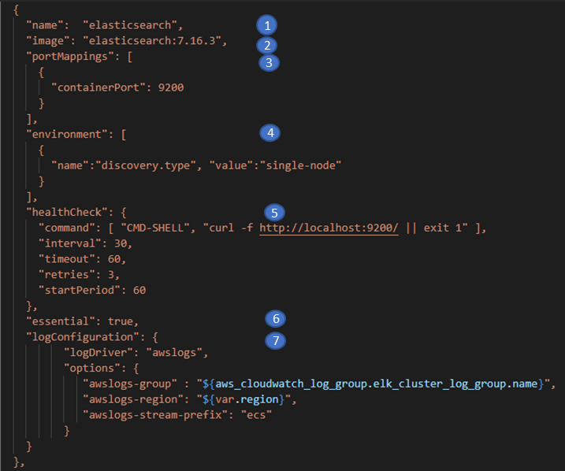
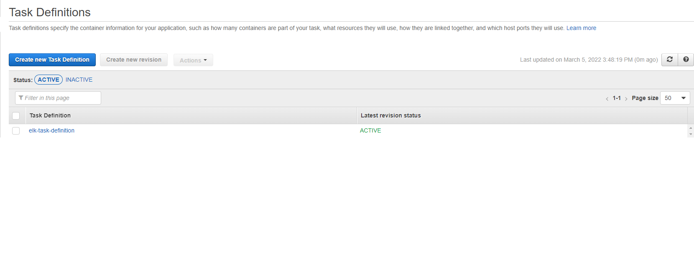
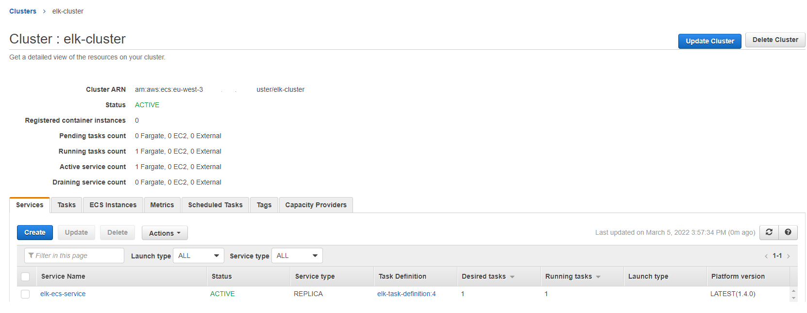
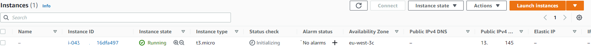
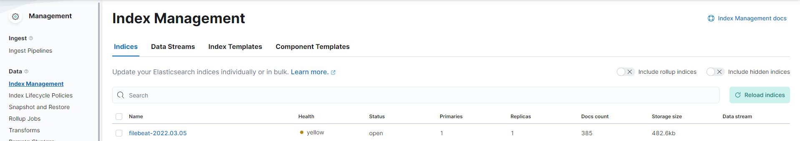

# Installation d'un cluster ELK sur AWS ECS FARGATE
L'objectif de ce projet est de vous montrer, pas à pas, comment installer un cluster ELK sur AWS ECS. Au lieu de faire l'installation à travers la console aws, dans ce projet j'ai fait le choix d'utiliser Terraform, un outil d'IaC (Infrastructure as Code).
Je vous présenterai brièvement ELK et Terraform avant de rentrer dans le vif du sujet.
# Prérequis
## A savoir
Pour aborder ce projet, vous devez connaître ou au moins avoir des notions sur :
* AWS IAM
* AWS VPC
* AWS EC2
* Docker
## Outils à installer
* AWS CLI V2 : https://docs.aws.amazon.com/cli/latest/userguide/getting-started-install.html
* Terraform  : Dans le cadre de ce projet, j'ai testé la version v1.1.5 https://github.com/hashicorp/terraform/releases/tag/v1.1.5. Toute version ultérieure devrait fonctionner.

# ELK
ELK est une stack logicielle permettant la centralisation de logs. Elle est constituée de :
- Elasticsearch : c'est un outil d'indexation et de recherche de données.
- Logstash : c'est un outil de collecte, analyse et stockage de logs.
- Kibana : c'est un outil de visualisation de données indexées par elasticsearch.

Un cas d'utilisation est la centralisation de toutes les logs des applications d'une entreprise. Les applications envoient les logs à Logstash, qui les colllecte, les analyse et les envoie à elasticsearch pour être indexées. Les développeurs, par exemple, pourraient se connecter à Kibana afin de visualiser les logs qui les intéresseraient. 

# Terraform
Terraform est un outil open source d'insfrastructure as code. Il permet de créer des resources sur plusieurs cloud provider (AWS, GCP, Azure, etc).
J'utilise Terraform pour créer mes ressources, lors de mes apprentissages, plutôt qu'à travers la console aws pour les raisons suivantes :
* l'itération et la reproductibilité. Je peux construire un projet étape par étape. Je pourrai reproduire l'infrastructure facilement plus tard pour d'autres besoins.
* le code me servira de documentation lorsque je reviendrai pour voir comment créer et configurer une ressource.
* la possibilité de porter les ressources d'un compte à l'autre facilement.
## State
Terraform conserve l'état de l'insfrastructure qu'il a crééé dans un fichier : le state.
Ce fichier permet à Terraform d'identifier les modifications à apporter à l'infrastructure lors d'une prochaine exécution.
Pour aller plus loin : https://www.terraform.io/language/state
## Configuration
Pour écrire du code Terraform, on utilise le HCL. C'est un langage de configuration développé par Hashicorp pour ses outils d'automatisation.
Le code est organisé dans des fichiers qui portent l'extension .tf.
Terraform exécute le code de tous les fichiers .tf à la racine d'un répertoire.
### Provider
Terraform est multi cloud. On peut définir du code pour la plupart des cloud provider (aws, gcp, azure, etc.). Pour spécifier à Terraform le cloud provider pour lequel on écrit du code, on configure son provider. On peut le faire dans un fichier nommé provider.tf.
Exemple de provider.tf
```
provider "aws" {
  region = "eu-west-3"
  profile = "default"
}
```
Ici on déclare qu'on utilise le provider aws. Donc l'infrastructure sera déployée sur aws.
On précise la région et le profile. Ce dernier doit correspondre à un profile configuré dans le fichier credential de votre configuration aws (sur windows C:\Users\ username\\.aws\credentials).
### Variables
Terraform permet de définir des variables et de les réutiliser dans le code. 
Il existe 3 types de variables : input variables, output variables et local variables (https://www.terraform.io/language/values) 
Il existe différentes façons de déclarer ces variables et de les initialiser.
Dans le cadre de ce projet, j'utilise que les input variables. Elles sont déclarées dans un fichier variables.tf et initialisées dans un fichier terraform.tfvars.
## Les principales commandes
On utilise terraform à travers une ligne de commande.
### Init
Depuis le répertoire racine où sont situés les fichiers source, on exécute la commande ```terraform init```. Cette commande permet d'initialiser le contexte terraform pour le projet en cours, de télécharger le provider et certaines dépendances.
### Plan
La commande ```terraform plan``` permet de lister les modifications que Terraform va apporter sur l'infrastructure. Il s'appuie sur son state et le code source pour déterminer les différences et les afficher en sortie de console.
### Apply
La commande ```terraform apply``` va appliquer les modifications listées dans le "plan" (création et/ou suppression de ressources, modification de propriétés de ressources, etc.)
### Destroy
La commande ```terraform destroy``` permet de supprimer toutes les ressources créées par Terraform. Cette commande est pratique dans le cadre d'un apprentissage pour supprimer toutes les ressources qu'on a crée pour ses tests, à partir une seule ligne de commande. Ainsi ne pas payer pour une ressource qu'on aurait oublié de supprimer à la main.
Pour aller plus loin sur Terraform voici le lien du site officiel (en anglais) : https://www.terraform.io/language
# ECS
ECS (Elastic Container Service) est un service proposé par AWS pour créer et ochestrer l'exécution de containers Docker. Les containers sont exécutés dans un cluster.
## Les composants
### Task definition
La task definition permet de créer et configurer un ou plusieurs containers. 
C'est un fichier au format JSON qui permet d'indiquer l'image Docker qui sera utilisée pour créer le container, le nom du container, d'éventuelles variables d'environnement, la configuration réseau, le montage de volume, etc. On retrouve la plupart des paramètres qu'on passe à Docker lorsqu'on lance un container.
On peut définir plusieurs containers.

### Task
Une task est l'instanciation d'une task definition. Elle représente le(s) container(s) définis dans la task definition, en exécution.
On peut lancer une task manuellement ou plusieurs à travers un service.

### Service
Lorsqu'on veut automatiser le lancement des tasks on utilise un service. Ce dernier permet de préciser le nombre de task qu'on désire lancer, à quel moment les lancer. Il gère aussi le lancement d'une nouvelle task lorsqu'une est failed ou stopped.

### Cluster
Un cluster est un regroupement logique de tasks, containers en exécution.

## Modes de fonctionnement
ECS offre deux modes de fonctionnement :
* A travers des instances EC2 : ECS EC2. Dans ce mode, le cluster comprend un certain nombre d'instances EC2. Chaque instance EC2 contient un agent Docker qui exécute des tâches. Lors de la création du cluster, on choisit les caractéristiques des instances EC2.
* Sans instances EC2 : ECS FARGATE. Il s'agit du mode serverless. On définit juste la quantité de mémoire et la puissance de calcul CPU dont on a besoin pour exécuter les tâches. Dans ce projet, j'ai fait le choix de FARGATE.

# Les étapes du projet

## Architecture
Voici l'architecture de l'infrastructure qu'on mettra en place.

Sur le schéma, sont représentés les 3 containers Docker elasticsearch, logstash et kibana. 
Ils font partie de la même task.
Celle ci est lancée à travers un service, nommé ELK Service.
AWS Fargate fournit l'infrastructure d'exécution des containers.

## Créer le réseau

Le script Terraform 00-network\main.tf permet de créer un VPC et deux subnets publics.

On crée un VPC
```
resource "aws_vpc" "main"{
    cidr_block = "10.0.0.0/16"

    tags = {
        Name = "elk-cluster-vpc"
    }
}
```
On crée 2 subnets publics. L'un qui va contenir la stack elk ...
```
resource "aws_subnet" "public_elk" {
  vpc_id = aws_vpc.main.id
  cidr_block = "10.0.1.0/24"
  availability_zone = "eu-west-3a"
  map_public_ip_on_launch = true
  tags = {
    Name = "subnet-public-elk"
  }
}
```
... et l'autre qui va contenir une instance EC2 pour envoyer des metrics à logstash.

```
resource "aws_subnet" "public_other" {
  vpc_id = aws_vpc.main.id
  cidr_block = "10.0.2.0/24"
  availability_zone = "eu-west-3a"
  map_public_ip_on_launch = true

  tags = {
    Name = "subnet-public-other"
  }
}
```
### Exécution
Dans le fichier 00-network\main.tf vous verrez l'intégralité de la configuration.
Pour créer le réseau, se placer dans le répertoire 00-network depuis une ligne de commande (CMD ou Powershell si vous êtes sur windows).
Créer un fichier terraform.tfvars et renseigner les valeurs des variables suivantes :
* profile : correspond au profile à utiliser pour se connecter à aws défini dans votre fichier credential aws.
* region : la région aws où l'infrastrure sera créée. Par exemple eu-west-3 pour la région Paris.
* my_ip : votre adresse IP publique en notation CIDR (rrr.xxx.yyy.zzz/32).

Exemple de terraform.tfvars
```
profile = "ici_mon_profile_aws"
region = "ici_ma_region_aws"
my_ip = "ici_mon_ip_public/32"
```

Lancer la commande ```terraform init``` pour initialiser le répertoire de travail avec les fichiers de configuration de terraform. Un répertoire .terraform est généré et un fichier .terraform.lock.hcl.

Lancer la commande  ```terraform plan```. Terraform vous affiche sur la console les modifications qu'il va apporter sur votre compte aws.

Lancer la commande  ```terraform apply``` pour appliquer les modifications.
Depuis la console aws vpc, vous pouvez visualiser le VPC créé ainsi que les subnets et tout le reste de la configuration (table de routage, etc).
La commande apply génère le fichier state : terraform.tfstate.


## les roles IAM

On a principalement besoin d'un role iam dans le cadre d'un cluster FARGATE :
* ecs_task_execution_role (voir le fichier 01-roles\main.tf) qui permet de télécharger l'image Docker (pull image) et d'envoyer des logs dans Cloudwatch.
On peut créer un role iam pour les tasks qui ont besoin d'appeler des services aws, par exemple s3.
### Exécution
Dans le fichier 01-roles\main.tf vous verrez l'intégralité de la configuration.
Se placer dans le répertoire 01-roles depuis une ligne de commande (CMD ou Powershell si vous êtes sur windows).
Créer un fichier terraform.tfvars et renseigner les les valeurs des variables suivantes :
* profile : correspond au profile à utiliser pour se connecter à aws défini dans votre fichier credential aws.
* region : la région aws où l'infrastrure sera créée. Par exemple eu-west-3 pour la région Paris.

Lancer la commande ```terraform init``` pour initialiser le répertoire de travail avec les fichiers de configuration de terraform.

Lancer la commande  ```terraform plan```. Terraform vous affiche sur la console les modifications qu'il va apporter sur votre compte aws.

Lancer la commande  ```terraform apply``` pour appliquer les modifications.

Rendez vous sur la console aws IAM, section Roles pour voir le role créé :


## Cluster
Dans le fichier 02-elk-cluster\main.tf vous verrez l'intégralité de la configuration du cluster elk.
### Exécution
Se placer dans le répertoire 02-elk-cluster depuis une ligne de commande (CMD ou Powershell si vous êtes sur windows).
Créer un fichier terraform.tfvars et renseigner les valeurs des variables suivantes :
* profile : correspond au profile à utiliser pour se connecter à aws défini dans votre fichier credential aws.
* region : la région aws où l'infrastrure sera créée. Par exemple eu-west-3 pour la région Paris.

Lancer la commande ```terraform init``` pour initialiser le répertoire de travail avec les fichiers de configuration de terraform.

Lancer la commande  ```terraform plan```. Terraform vous affiche sur la console les modifications qu'il va apporter sur votre compte aws.

Lancer la commande  ```terraform apply``` pour appliquer les modifications.

Rendez vous sur la console aws ECS, section Clusters pour voir le cluster créé :


## Task definition
Dans le cadre de ce projet j'ai créé une task definition de type FARGATE :
```
resource "aws_ecs_task_definition" "elk_task_definition" {
  family                    = "elk-task-definition"
  requires_compatibilities  = [ "FARGATE" ]
```
Pour les task definition de type FARGATE, le seul mode de network disponible est awsvpc. Dans ce cas, AWS crée une ENI (Elastic Network Interface, une carte réseau virtuelle) pour chaque task (Pour rappel, une task est l'instanciation d'une task definition). 
```
network_mode              = "awsvpc"
```
AWS associe une IP à l'ENI.

j'ai déclaré trois containers : elasticsearch, kibana et logstash.

Exemple : définition du container elasticsearch :



1.  name : Le nom de notre container. Ici elasticsearch
2.  image : L'image Docker qui sera utilisée pour créer le container. Par défaut, ECS cherchera dans le registry officiel Docker. On peut spécifier d'autre registry comme ECR d'AWS ou un registry privé.
3. portMappings : On définit le port que le container exposera. On a pas besoin de spécifier le port du host auquel il sera mappé dans le cadre d'un container exécuté par FARGATE. En effet, avec FARGATE, chaque task est liée à sa propre ENI. Les containers de la task partagent la même adresse IP. Chacun exposera un port spécifique. Si on définit plusieurs tasks, il n'y a pas de risque de collision de ports.
4. environment : Avec ce paramètre, on liste les variables d'environnement qu'on passe au container. Ici je passe le paramètre "discovery.type" qui indique à elasticsearch s'il doit fonctionner en mode cluster avec plusieurs noeuds ou single node dans notre cas.
5. healthCheck : Il est important de définir un healthcheck pour vérifier que le service embarqué dans le container fonctionne bien. 

    1. command : représente la commande que Docker exécutera à l'intérieur du container
    2. interval : représente l'intervalle de temps en secondes entre 2 exécutions de command
    3. retries : représente le nombre max de fois que command sera exécutée jusqu'au succès. Sinon, si le nombre max est atteint, le healthchek est en échec.
    4. timeout : représente le temps max en secondes que Docker attendra la réponse du service.
    5. startPeriod : représente la période de temps en seconde que Docker attendra avant de lancer command la première. Docker attendra que le container démarre pendant ce temps.
6. essential : Pour les task definition qui contiennent plusieurs containers, il est important de définir le ou les containers "essential". Lorsqu'un container "essential" n'est plus en exécution, les autres containers de la même task seront arrêtés.
7. logConfiguration : Ici on définit les paramètres de log. Dans le cadre de ce projet, j'utilise le driver awslogs. Ce qui permet de voir les logs du container dans Cloudwatch.
### Exécution
Dans le fichier 03-elk-task-definition\main.tf vous verrez l'intégralité de la configuration.
Se placer dans le répertoire 03-elk-task-definition depuis une ligne de commande (CMD ou Powershell si vous êtes sur windows).
Créer un fichier terraform.tfvars et renseigner valeurs des variables suivantes :
* profile : correspond au profile à utiliser pour se connecter à aws défini dans votre fichier credential aws.
* region : la région aws où l'infrastrure sera créée. Par exemple eu-west-3 pour la région Paris.

Lancer la commande ```terraform init``` pour initialiser le répertoire de travail avec les fichiers de configuration de terraform.

Lancer la commande  ```terraform plan```. Terraform vous affiche sur la console les modifications qu'il va apporter sur votre compte aws.

Lancer la commande  ```terraform apply``` pour appliquer les modifications.

Se rendre sur la console aws ECS, section Task Definition pour voir la task definition créée :

## Service
Dans le répertoire 04-elk-service, le fichier main.tf contient la définition de notre service. 
```
resource "aws_ecs_service" "elk_ecs_service" {
  name = "elk-ecs-service"
  cluster = data.aws_ecs_cluster.elk_cluster.arn
  task_definition = data.aws_ecs_task_definition.elk_task_definition.arn
  desired_count = 1
  network_configuration {
    subnets = [ data.aws_subnet.public_elk.id ]
    security_groups = [ data.aws_security_group.allow_access_elk.id ]
    assign_public_ip = true
  }
}
```
Le service est configuré pour lancer une seule task au sein du cluster créé précédemment. Il lancera la task dans le subnet public elk, créé aussi précédemment.
On protège l'accès aux containers à travers le security group allow_access_elk créé plus haut. On autorise que la connexion en http au port 5601 qui correspond au port d'écoute de kibana.
### Exécution
Dans le fichier 04-elk-service\main.tf vous verrez l'intégralité de la configuration.
Se placer dans le répertoire 04-elk-service depuis une ligne de commande (CMD ou Powershell si vous êtes sur windows).
Créer un fichier terraform.tfvars et renseigner les valeurs des variables suivantes :
* profile : correspond au profile à utiliser pour se connecter à aws défini dans votre fichier credential aws.
* region : la région aws où l'infrastrure sera créée. Par exemple eu-west-3 pour la région Paris.

Lancer la commande ```terraform init``` pour initialiser le répertoire de travail avec les fichiers de configuration de terraform.

Lancer la commande  ```terraform plan```. Terraform vous affiche sur la console les modifications qu'il va apporter sur votre compte aws.

Lancer la commande  ```terraform apply``` pour appliquer les modifications.

Se rendre sur la console aws ECS, section Cluster. Cliquer sur le cluster elk-cluster. Sélectionner l'onglet Services pour voir notre service elk-ecs-service. Pour voir les détails du service, notamment la task lancée, cliquer sur le service.



## Instance EC2 
Dans le répertoire 05-ec2-instance, le fichier main.tf contient la déclaration de l'instance ec2. On copie le fichier filebeat.yml dans l'instance grâce au provisionning.
On installe des packages sur l'instance grâce, toujours, au provisionning.
Dans le fichier filebeat.yml, modifier l'adresse de logstash (hosts: ["10.0.1.60:5044"]) avec l'ip privée générée pour votre task. 
### Exécution
Se placer dans le répertoire 05-ec2-instance depuis une ligne de commande (CMD ou Powershell si vous êtes sur windows).
Créer un fichier terraform.tfvars et renseigner valeurs des variables suivantes :
* profile : correspond au profile à utiliser pour se connecter à aws défini dans votre fichier credential aws.
* region : la région aws où l'infrastrure sera créée. Par exemple eu-west-3 pour la région Paris.
* key_name : Créer une key pair sur votre compte aws dans la région où vous déployez le cluster (si vous en avez pas) et renseigner le nom de cette key pair comme valeur de cette variable.
* ssh_private_key_path : le chemin complet vers la clé privée de la key pair.

Lancer la commande ```terraform init``` pour initialiser le répertoire de travail avec les fichiers de configuration de terraform.

Lancer la commande  ```terraform plan```. Terraform vous affiche sur la console les modifications qu'il va apporter sur votre compte aws.

Lancer la commande  ```terraform apply``` pour appliquer les modifications.

Se rendre sur la console aws EC2 pour voir l'instance créée.


## Visualisation des métriques 

Récupérer l'adresse ip publique de la task à partir de la console ECS.
Tapez-la dans un navigateur en rajoutant le port 5601 afin d'accéder à la console de kibana (<ip_de_la_task:5601>).

Vous pouvez exploiter les métriques envoyées dans l'index créé par filebeat en suivant ce lien pour créer un index pattern: https://www.elastic.co/guide/en/kibana/7.17/index-patterns.html 
Après avoir créé l'index pattern, re cliquer sur "Discover" dans le menu de kibana et selectionner votre index pattern pour afficher les metriques de filebeat.

Voilà !
